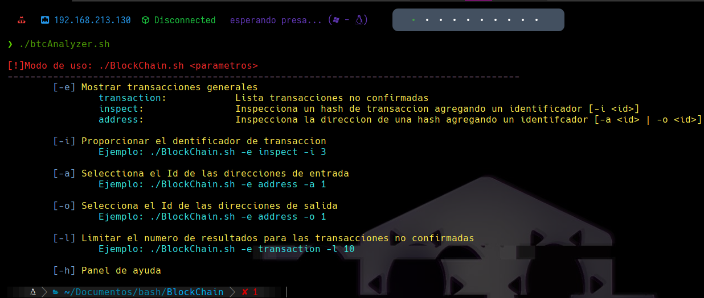
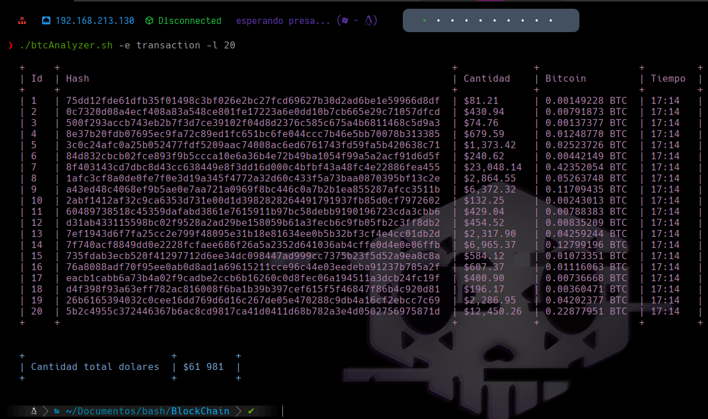
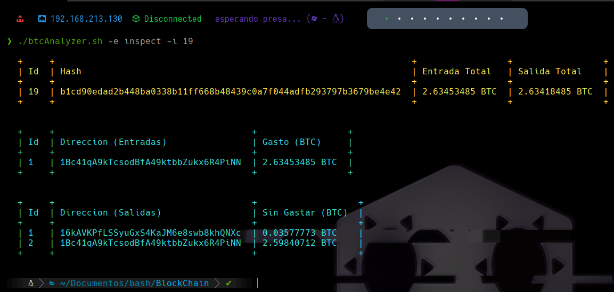
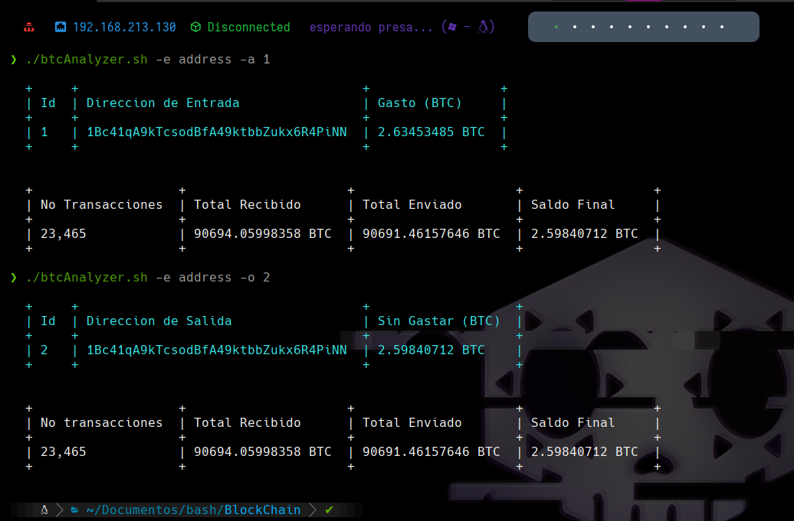

# btcAnalyzer

**btcAnalyzer** es una herramienta hecha en Bash ideal para inspeccionar transacciones en el servicio de exploración de bloques de Bitcoin, conocido como Blockchain (blockchain.com).

¿Quieres saber cuánto dinero se mueve por el mundo?, te sorprenderán algunas transacciones.

Requisitos previos
======
Antes de ejecutar la herramienta, es necesario instalar las siguientes utilidades a nivel de sistema:

```bash
apt install html2text bc -y
```

Una vez instalado, podrás continuar en el siguiente punto.

¿Cómo ejecuto la herramienta?
======
Para empezar, tras ejecutar la herramienta, veremos lo siguiente:

<p align="center">

</p>

La herramienta cuenta con 3 modos de exploración:

* transaction
* inspect
* address

La primera de ellas, nos permite listar las transacciones que se están realizando en tiempo real, indicando a través del parámetro '**-l**' el número de transacciones totales a representar:

<p align="center">

</p>

En caso de querer inspeccionar una transacción, podemos colocar el numero de identificador de la transacción que se muestra en la primera columna y a través del modo de exploración '**inspect**', inspeccionar la misma, listando así las direcciones de entrada y de salida correspondientes. Es necesario hacer uso del parámetro '**-i**' para especificar el numero del identificador de la transacción:

<p align="center">

</p>

Actualmente, las direcciones de entrada y salida se filtran de la primera página. En caso de que la transacción como dirección de entrada o salida cuente con múltiples direcciones, a veces estas son representadas en otras páginas, si alguien se anima a scriptear esta parte para que pille el total de páginas y se te listen todas las direcciones involucradas, podéis hacerme un pull request y lo publico en el código :)

En caso de querer investigar las direcciones involucradas (tanto de entrada y de salida) en la transacción, a través del modo de exploración '**address**' y haciendo uso del parámetro '**-a**' para especificar el Id de la dirección de entrada o el parametro '**-o**' para especificar el ID de la direccion de salida, podremos listar la información más relevante de la dirección especificada:

<p align="center">

</p>

